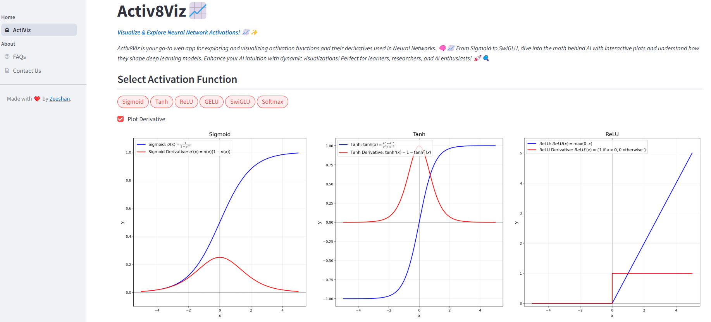
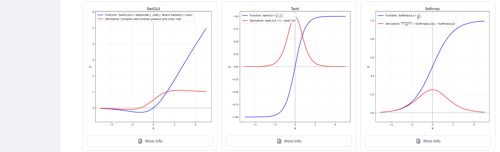
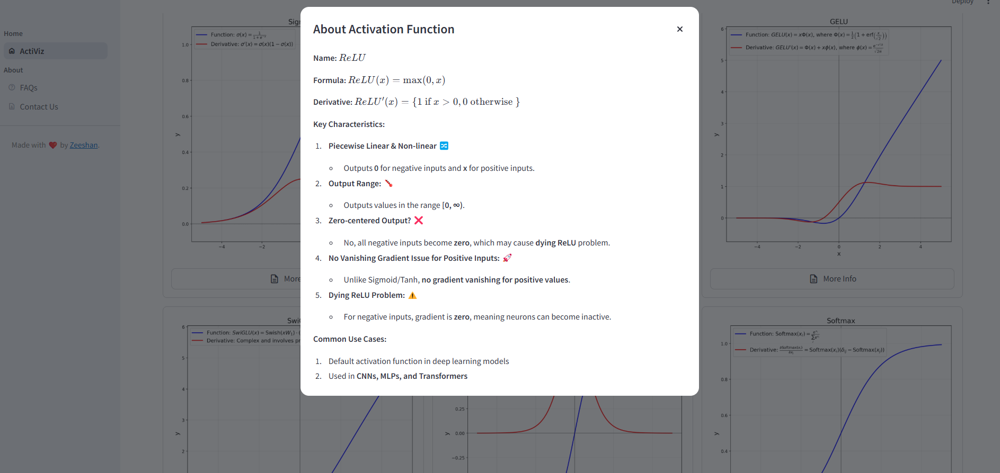

# Activ8Viz 📈
Visualize & Explore Neural Network Activations! 📈✨

Activ8Viz is your go-to web app for exploring and visualizing activation functions and their derivatives used in 
Neural Networks. 🧠📈 From Sigmoid to SwiGLU, dive into the math behind AI with interactive plots and understand how 
they shape deep learning models. Enhance your AI intuition with dynamic visualizations! Perfect for learners, researchers, 
and AI enthusiasts! 🚀🔍

# Application Link
https://nn-activations.streamlit.app/

# Technologies Used
* Streamlit -- Front end development
* Matplotlib -- For visualization
   
# System Requirements
You must have Python 3.11 or later installed.

# Installation
1. Clone this repository
2. Create a virtual environment
3. Install the necessary python packages:
   `pip install -r requirements.txt`
4. Run the application with following command from terminal:

   `streamlit run app.py`

# Screen Shots

